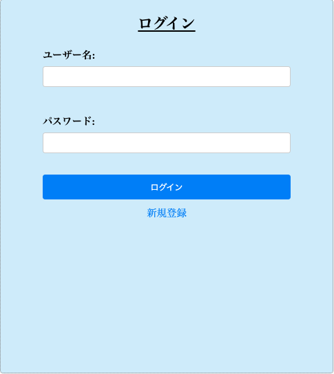
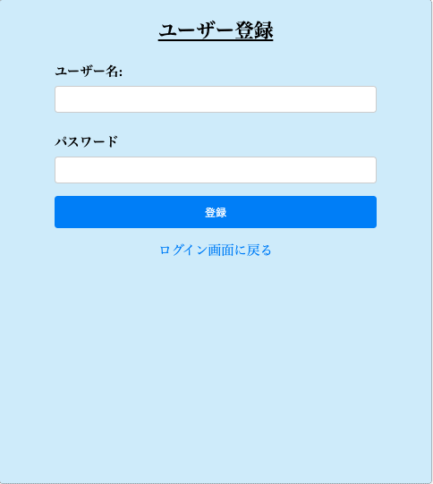
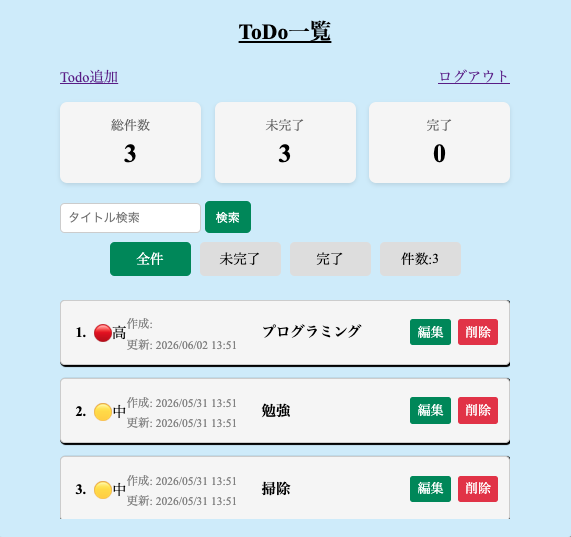
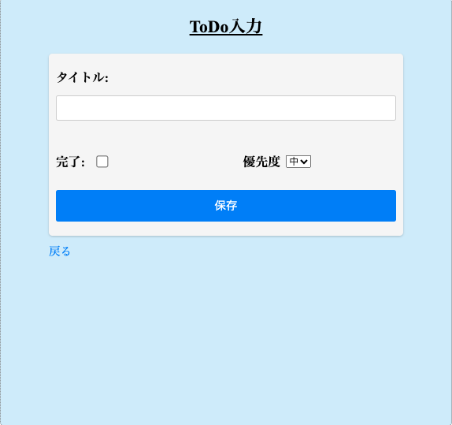

# Spring Boot ToDoアプリ (H2版)

このアプリは、Java と Spring Boot を使って開発した ToDoリスト管理アプリです。
H2データベースを使用し、 Renderにデプロイして公開しています。
就職活動用ポートフォリオとして作成しました。

---

## 公開URL

Render: [https://springboot-todo-skpo.onrender.com](https://springboot-todo-skpo.onrender.com)

※Renderは無料プランのため、アプリの使用には事前に開発側での起動が必要です。

---

## 使用技術

- Java 17
- Spring Boot 3.x
- Spring Security
- Spring MVC / Thymeleaf
- Spring Data JPA
- H2 Database
- Maven
- Render (デプロイ)
- Docker (オプション)

---

## 主な機能

- ユーザー登録 / ログイン / ログアウト
- タスクの一覧表示
- タスクの追加 / 編集 / 削除
- タスクの完了チェック機能
- ユーザーごとにToDoを管理

---
## 追加機能

- ToDo優先度管理
  - 高 / 中 / 低 の3段階
  - 優先度順 + 作成日時潤で表示

- 検索機能
  - タイトル部分一致検索

- フィルタ機能
  - 全件表示
  - 未完了のみ表示
  - 完了のみ表示

- ダッシュボード
  - 全Todo件数
  - 未完了件数
  - 完了件数

- バリデーション
  - 入力チェック
  - 文字数制限

- 例外処理
  - GlobalExceptionHandlerによる共通エラー処理

---

# ディレクトリ構成(例)

```

src/
└━main/
    ┝━━━java/com/example/todo/
    │┝━━━controller/
    │┝━━━entity/
    │┝━━━repository/
    │┝━━━service/
    |└━━━TodoApplication.java
    └━━━resources/
        ┝━━static/
        ┝━━━templates/
        └━━━application.properties

```

---

## ローカルでの実行方法(H2使用)

# Spring Boot 実行

./mvnw spring-boot:run

- H2コンソール：http://localhost:8080/h2-console
- JDBC URL:jdbc:h2:mem:testdb

---

## スクリーンショット

### ログイン画面



### 登録画面



### Todoリスト画面


### Todo登録画面


---